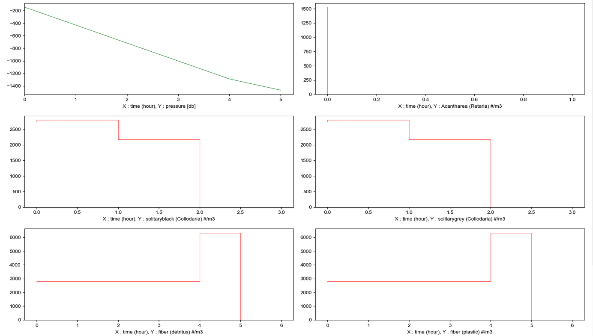

Le répertoire `gendb` contient du code permettant de générer des données pour les tests. Utiliser `GenerateDB.py` pour lancer la génération.

## Détails des opérations effectuées
* Initialisation d'une base de données vierge
* chargement d'un fichier taxo
* Creation de projets ExoTaxa Zoo avec les especes suivantes 
    * living>Eukaryota>Harosa>Rhizaria>Retaria>Acantharea 	
    * living>Eukaryota>Harosa>Rhizaria>Retaria>Polycystinea>Collodaria>solitaryblack 	
    * living>Eukaryota>Harosa>Rhizaria>Retaria>Polycystinea>Collodaria>solitarygrey 	
    * not-living>detritus>fiber 	
    * not-living>plastic>fiber 	
    
Avec la répartition suivante 

En series temporelles:

* Génération d'un projet particulaire de référence avec des distribution particulaire remarquables

Graphes détaillés :

Graphes réduits :

Graphes détaillés sur series temporelles:

Graphes réduits sur series temporelles:

* Generation de données CTD à partir de 2 fichiers CTD réel un peu adaptés sur les samples 2 et 3

En series temporelles, seul sample2 contient un horodatage :

* Generations de fichiers importables au formats
    * BRU UVP5
    * BRU1 UVP5
    * UVPAPP
    * LISST
    * Remote Lambda
    
* Generations de samples sans données uniquement pour faires des essais d'affichage sur la carte
    * Geo Sample on all the map pour faire des essais sur les projections
    * Geo Sample from Mosaic pour comparer les affichages avec des données réllées a proximité du pole nord

